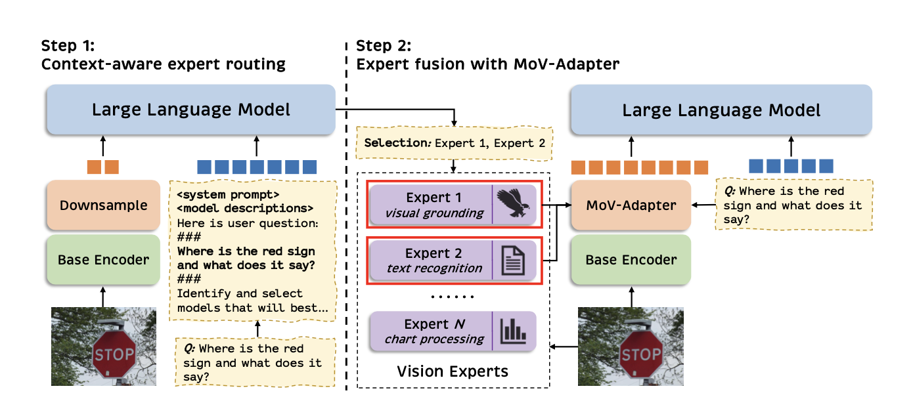

# MoVA: Adapting Mixture of Vision Experts to Multimodal Context

Official repository for the paper "MoVA: Adapting Mixture of Vision Experts to Multimodal Context".

[[📖 Paper](https://huggingface.co/papers/2404.13046)] [[🤗 Huggingface Model](https://huggingface.co/zongzhuofan/llama3-mova-8b)]

## 💥 News

- **[2024.06.28]** 🔥 We release the codes and the MoVA-8B model.
- **[2024.04.22]** 🚀 We release our paper on arXiv.


## 👀 About MoVA

To alleviate the bias of CLIP vision encoder, we first delve into the inherent behavior of different pre-trained vision encoders and then propose the **MoVA**, a powerful and novel MLLM, adaptively routing and fusing task-specific vision experts with a coarse-to-fine mechanism.



MoVA consists of two stages: coarse-grained context-ware expert routing and fine-grained expert fusion with MoV-Adapter.
1. **Coarse-grained context-ware expert routing**: 
First, MoVA leverages the tool-use capabilities of LLM and aims to employ LLM to select vision experts with strong relevance to the user's image and instruction from the expert model pool. Thanks to the strong generalization ability of LLM, we also can perform model routing for vision experts in open scenarios.

2. **Fine-grained expert fusion with MoV-Adapter**: 
In the second stage, we turn to enhance the visual representation with a novel MoV-Adapter module in a fine-grained manner.
More specifically, we leverage the cross-attention mechanism to extract the task-specific knowledge of representations from chosen experts.
Meanwhile, the dynamic gating network in MoV-Adapter can allocate soft weights to the extracted knowledge of each expert according to the input image and instruction.
Then the extracted knowledge can be effectively integrated into the foundational representation of the base vision encoder.

MoVA with **Vicuna-7B**, **Llama3-8B** and **Hermes-Yi-34B** can achieve significant performance gains over current state-of-the-art methods in a wide range of challenging benchmarks.

## 🤖 Model Zoo

### MultiModal Benchmark

| Name | LLM | \#Tokens | MME | MMBench | MMBench-CN | QBench | MathVista | MathVerse | POPE |
|---|---|---|---|---|---|---|---|---|---|
| [MoVA-8B](https://huggingface.co/zongzhuofan/llama3-mova-8b) | Llama3-8B | 576 | 1595.8 / 347.5 | 75.3 | 67.7 | 70.8 | 37.7 | 21.4 | 89.3 |

### General & Text-oriented VQA

| Name | LLM | \#Tokens | VQAv2 | GQA | SQA | TextVQA | ChartQA | DocVQA | AI2D |
|---|---|---|---|---|---|---|---|---|---|
| [MoVA-8B](https://huggingface.co/zongzhuofan/llama3-mova-8b) | Llama3-8B | 576 | 83.5 | 65.2 | 74.7 | 77.1 | 70.5 | 83.4 | 77.0 |

### Visual Grounding

 Name | LLM | \#Tokens | RefCOCO<br>(val) | RefCOCO<br>(testA) | RefCOCO<br>(testB) | RefCOCO+<br>(val) | RefCOCO+<br>(testA) | RefCOCO+<br>(testB) | RefCOCO&#8209;g<br>(val) | RefCOCO&#8209;g<br>(test) |
|---|---|---|---|---|---|---|---|---|---|---|
| [MoVA-8B](https://huggingface.co/zongzhuofan/llama3-mova-8b) | Llama3-8B | 576 | 92.18 | 94.75 | 88.24 | 88.45 | 92.21 | 82.82 | 90.05 | 90.23 |

## 💡 Evaluation

To ensure the reproducibility, we evaluate the models with greedy decoding. We do not evaluate using beam search to make the inference process consistent with the chat demo of real-time outputs.

We follow the evaluation settings of [LLaVA](https://github.com/haotian-liu/LLaVA). Please see [Evaluation.md](https://github.com/TempleX98/MoVA/blob/main/docs/Evaluation.md).

## 🧠 Acknowledgement

We would like to thank the following repos for their great work:

- The codebase of MoVA is built upon [LLaVA](https://github.com/haotian-liu/LLaVA).
- MoVA incorporates vision encoders from [CLIP](https://github.com/openai/CLIP), [DINOv2](https://github.com/facebookresearch/dinov2), [Co-DETR](https://github.com/Sense-X/Co-DETR), [SAM](https://github.com/facebookresearch/segment-anything), [Pix2Struct](https://github.com/google-research/pix2struct), [Deplot](https://huggingface.co/google/deplot), [Vary](https://github.com/Ucas-HaoranWei/Vary/tree/main), and [BiomedCLIP](https://huggingface.co/microsoft/BiomedCLIP-PubMedBERT_256-vit_base_patch16_224).

## ✅ Citation

If you find **MoVA** useful for your research and applications, please kindly cite using this BibTeX:

```latex
@article{zong2024mova,
  title={MoVA: Adapting Mixture of Vision Experts to Multimodal Context},
  author={Zong, Zhuofan and Ma, Bingqi and Shen, Dazhong and Song, Guanglu and Shao, Hao and Jiang, Dongzhi and Li, Hongsheng and Liu, Yu},
  journal={arXiv preprint arXiv:2404.13046},
  year={2024}
}
```